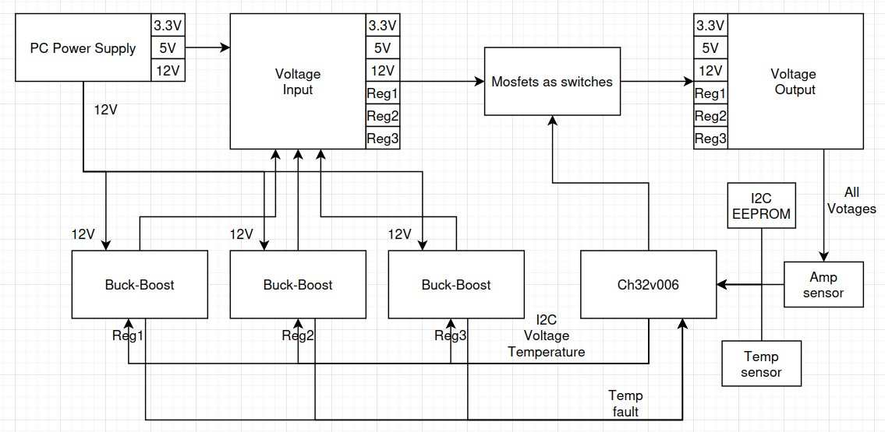
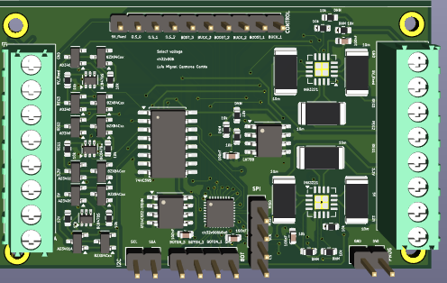
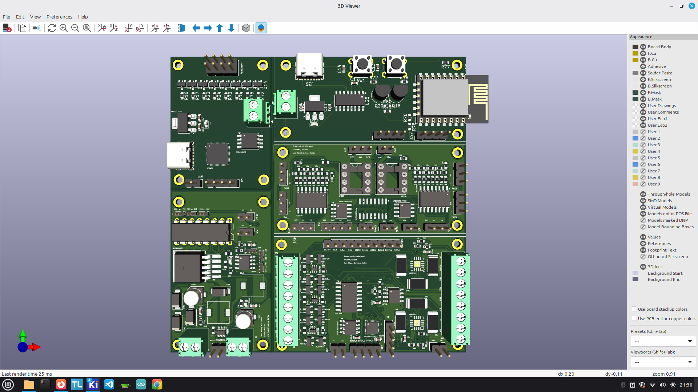

LABORATORY 

This is a full guide line to build a complete electronic laboratory.

WIth it you will have the following tools:

# 1. Power Supply

The Power Supply module is a high-versatility power distribution and regulation PCB designed to interface with a standard PC Power Supply. It provides multiple fixed and adjustable voltage rails, all managed by an integrated microcontroller for safety and monitoring.

  

<em>Figure 1. Power supply PCB schematic</em>

## 1.1 System architecture
### a) Input Stage

**PC Power Supply Interface:** The system draws its primary power from a standard PC PSU, utilizing the 3.3V, 5V, and 12V rails.

**Input Voltage to the DC-DC:** The 12V of the PC power supply get into three buck-boost regulators.

### B) Regulation Stage (Buck-Boost Converters)

The PCB features three independent Buck-Boost converters (Reg1, Reg2, and Reg3).

**Input:** 12V DC from the PSU.

**Function:** These converters allow for precise voltage adjustment (either stepping up or stepping down) with a digital potentiometer to provide customized "Regulated" rails that are not standard on a PC PSU.

**Feedback Loop:** These modules communicate via an I2C bus to set the voltage and to get temperature status.

### C) Control and User Interface

**Microcontroller (CH32V006):** The brain of the PCB. It monitors the I2C bus for data from the regulators and external sensors. Also set the voltage and controls the outputs with a serie of transistors.

**SPI Control:** The system utilizes a high-speed SPI bus for primary control (likely for an external display or high-speed communication with a master controller in the "Fully Remote Control" block).

**Physical Interface:** Features 3 Buttons for manual control:

1) Select/Mode: Cycle through the different voltage rails (Reg1, Reg2, Reg3).

2) Increment (+): Increase target voltage or current limits.

3) Decrement (-): Decrease target voltage or current limits.

**MOSFET Switching Array:** High-side switches controlled by the CH32V006 to enable or disable specific output rails instantly.

  

<em>Figure 2. Power supply Control PCB</em>

## Monitoring and Protection
| Component | Function |
|----------|----------|
| ina3221| Monitors current draw across all voltage rails to prevent over-current scenarios and cut off if the intensity goes hihger than if preset |
| lm75    | Monitors the PCB temperature. |
| EEPROM | Stores user presets (favorite voltages), safety threshold logs and erros logs. |

# Sine generator

# Health Monitoring

# Fully Remote Control

  

<em>Figure 1. The laboratory</em>

